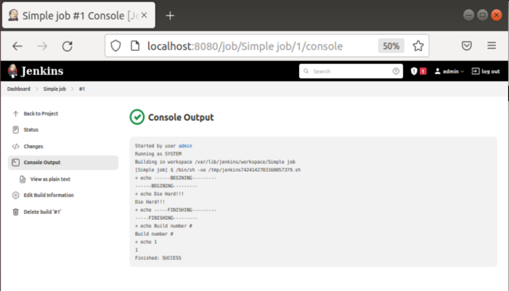
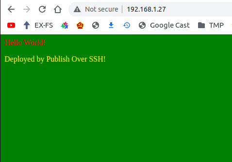
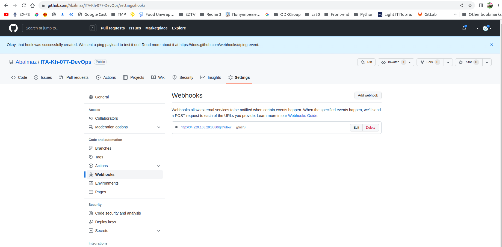
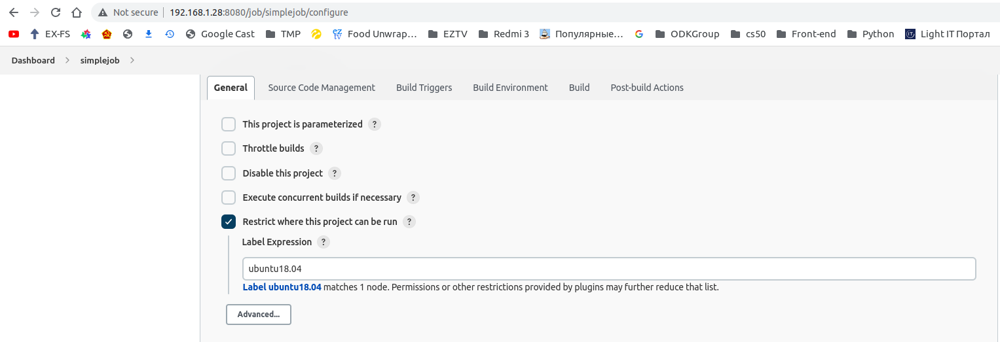
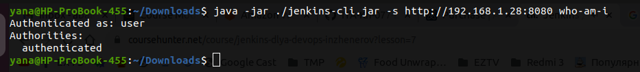

#### Simple job example in Jenkins

Simple job example in Jenkins (Finished: SUCCESS):

Simple job example in Jenkins (Finished: FAILED)

#### Simple job example in Jenkins with deploy.

Simple job example in Jenkins with deploy.
Establish SSH connection without login/password

#### Simple job example in Jenkins with deploy using plugin “Publish Over SSH”

#### Simple CI/CD pipeline example

#### Simple CI/CD pipeline example using AWS

#### Jenkins nodes (slaves)

#### Jenkins CLI
Connect to CLI from Jenkins host

Connect to CLI from remote host

Run command from CLI to export job in xml file:

#### Jenkins Pipeline

