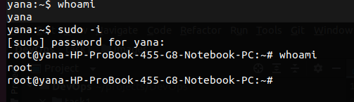
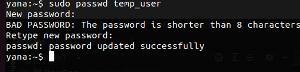
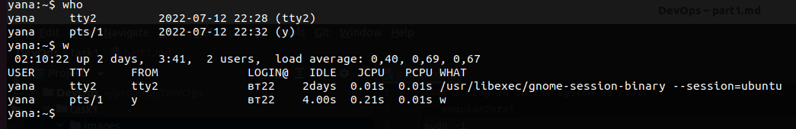
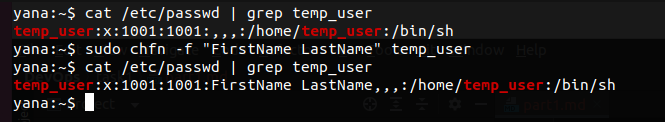
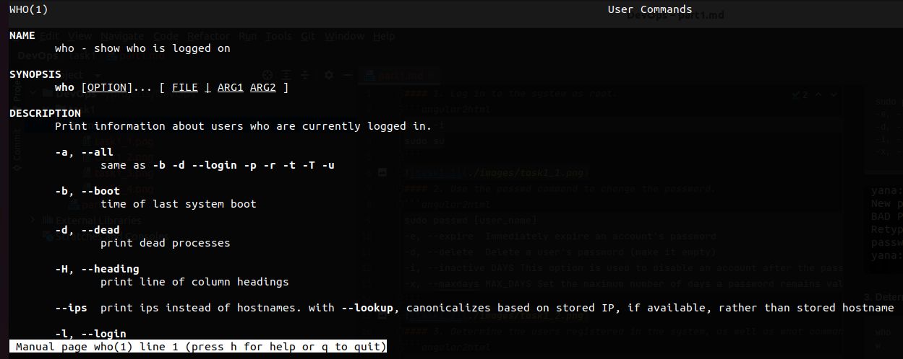
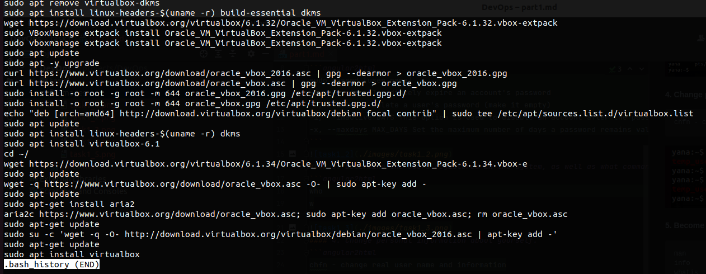
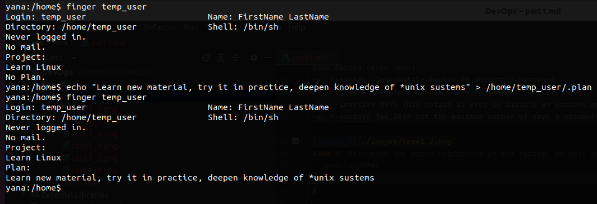

#### 1. Log in to the system as root.
```angular2html
sudo -i
sudo su
```

#### 2. Use the passwd command to change the password.
```angular2html
sudo passwd [user_name]
-e, --expire  Immediately expire an account's password
-d, --delete  Delete a user's password (make it empty)
-i, --inactive DAYS This option is used to disable an account after the password has been expired for a number of days
-x, --maxdays MAX_DAYS Set the maximum number of days a password remains valid
```

#### 3. Determine the users registered in the system, as well as what commands they execute
```angular2html
who
w
```

#### 4. Change personal information about yourself.
```angular2html
chfn - change real user name and information
```

#### 5. Become familiar with the Linux help system and the man and info commands.
```angular2html
man
info
whatis
```

#### 6. Explore the more and less commands using the help system. View the contents of files .bash* using commands.
```angular2html
more [options] file - file perusal filter for crt viewing
less [options] file - is similar to more, but it has many more features

less +G .bash_history
```

#### 7. Describe in plans that you are working on laboratory work 1
```angular2html
finger username
echo "Project name" > ~/.project
echo "Some plane" > ~/.plan
```

