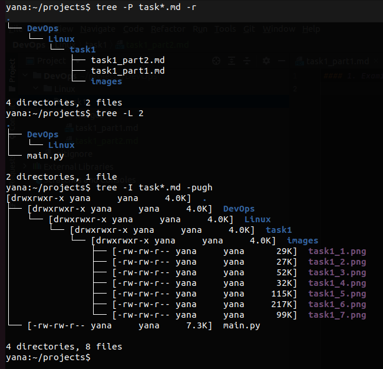
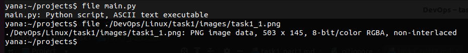
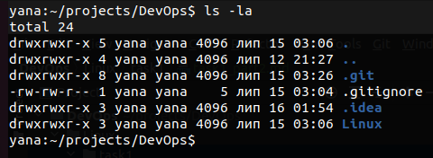
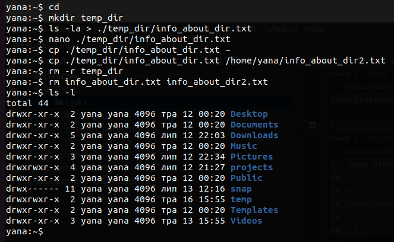
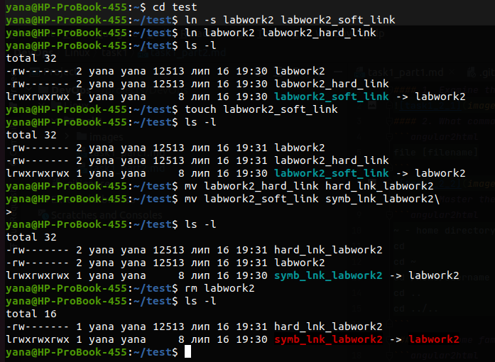
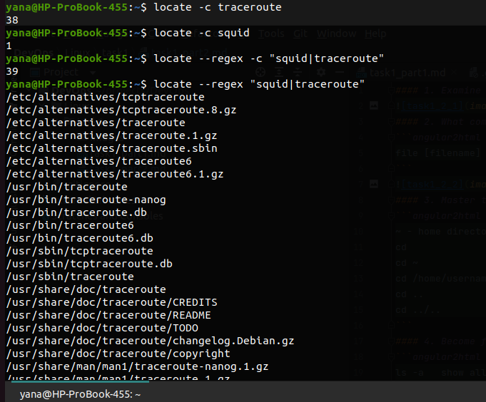
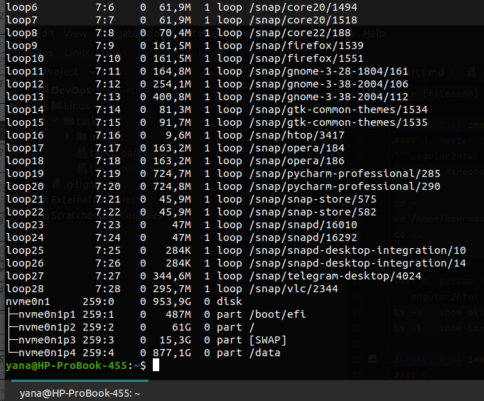
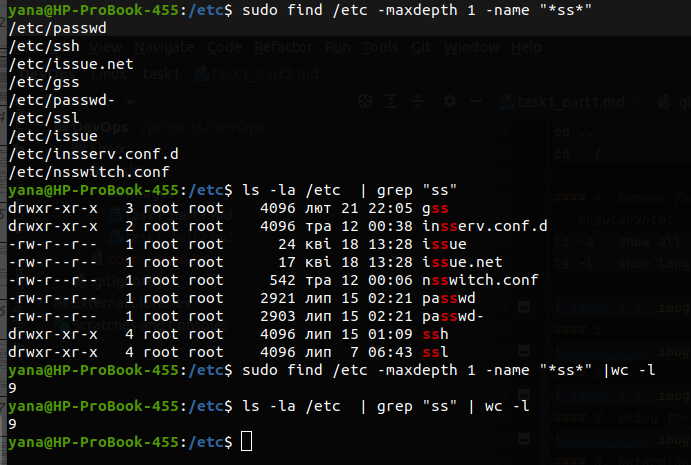
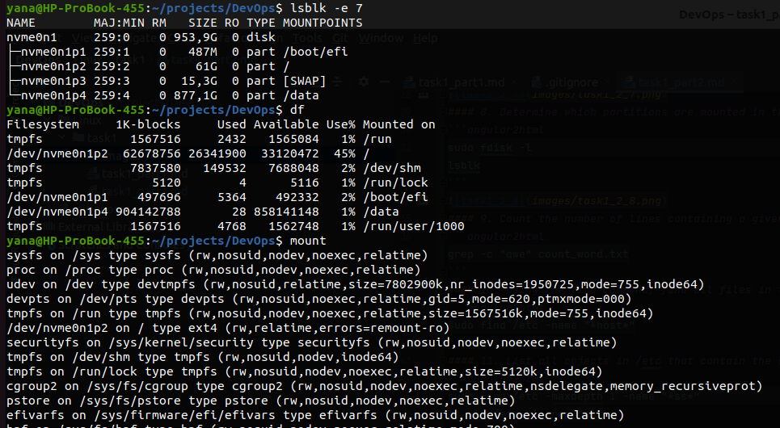
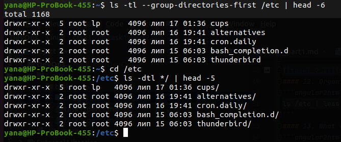

#### 1. Examine the tree command. Master the technique of applying a template, for example, display all files that contain a character c, or files that contain a specific sequence of characters. List subdirectories of the root directory up to and including the second nesting level.

#### 2. What command can be used to determine the type of file (for example, text orbinary)? Give an example.
```angular2html
file [filename]
```

#### 3. Master the skills of navigating the file system using relative and absolute paths. How can you go back to your home directory from anywhere in the filesystem?
```angular2html
~ - home directory (/home/username)
cd                - go to home dir
cd ~              - go to home dir
cd /home/username - go to home dir, using absolute path
cd ..             - go up 1 level dir
cd ../..          - go up 2 levels dir
```
#### 4. Become familiar with the various options for the ls command. Give examples of listing directories using different keys. Explain the information displayed on the terminal using the -l and -a switches.
```angular2html
ls -a   show all files and directories (including hiding, starting with dot)
ls -l   show long format, including access rights, owner, group, size, date of modify
```

#### 5. 

#### 6. 

#### 7. Using the locate utility, find all files that contain the squid and traceroute sequence.

#### 8. Determine which partitions are mounted in the system, as well as the types of these partitions.
```angular2html
sudo fdisk -l
lsblk
```

#### 9. Count the number of lines containing a given sequence of characters in a given file.
```angular2html
grep -c "qwe" count_word.txt
```
#### 10. Using the find command, find all files in the /etc directory containing the host character sequence.
```angular2html
sudo find /etc -name "*host*"
```
#### 11. List all objects in /etc that contain the ss character sequence. How can I duplicate a similar command using a bunch of grep?
```angular2html
sudo find /etc -maxdepth 1 -name "*ss*"
ls -la /etc  | grep "ss"
```

#### 12. Organize a screen-by-screen print of the contents of the /etc directory.
```angular2html
ls /etc | less
```
#### 13. What are the types of devices and how to determine the type of device? Give examples 
```angular2html
sudo fdisk -l
lsblk -e 7 # without loop(7)
mount
df
```

#### 14. How to determine the type of file in the system, what types of files are there?
| Symbol | File types            |
|--------|-----------------------|
| -      | regulare file         |
| d      | directory             |
| l      | link file             |
| c      | character device file |
| s      | local socket file     |
| p      | named pipe file       |
| b      | block device file     |

to determine type use `ls`
#### 15. List the first 5 directory files that were recently accessed in the /etc directory
```angular2html
ls -tl --group-directories-first /etc | head -6
```
or if /etc your current directory:
```angular2html
ls -dtl */ | head -5
```
