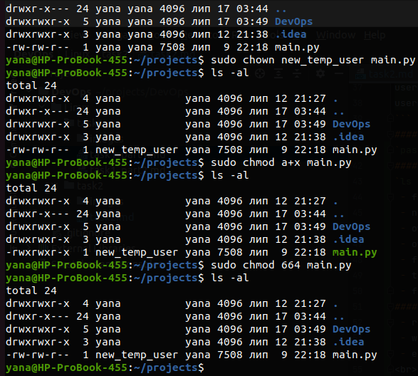

#### 1. Analyze the structure of the /etc/passwd and /etc/group file, what fields are present in it, what users exist on the system? Specify several pseudo-users, how to define them?
/etc/passwd `username: pswd: uid: gid: uid comments: directory: shell`

| column       | description                                   |
|--------------|-----------------------------------------------|
| username     | username                                      |
| pswd         | password                                      |
| uid          | user ID                                       |
| gid          | group ID                                      |
| uid comments | comment, general info about user              |
| directory    | user's home directory                         |
| shell        | program name - the user's command interpreter |

/etc/group `group_name:password:group_id:list`
<br>There are regular users, root user and pseudo users in the system. Pseudo users: daemon, bin, adm. 
To get all pseudo-users 
`awk -F: '(($3>=1)&&($3<1000))||($3==65534)' /etc/passwd`
#### 2. What are the uid ranges? What is UID? How to define it?
  * 0 - root user
  * 65534 - nobody user
  * 1-999 - system users
  * 1000 - 65533 - regular users
#### 3. What is GID? How to define it?
Unique identifier of the group within the system to which the user belongs.
#### 4. How to determine belonging of user to the specific group?
`id` for current user or `id [user_uid or name]`
#### 5. What are the commands for adding a user to the system? What are the basic parameters required to create a user?
`sudo useradd [user_name]` 
#### 6. How do I change the name (account name) of an existing user?
`sudo usermod -l new_user_name user_name`
#### 7. What is skell_dir? What is its structure?
“skeleton” directory is used to initiate home directory when a user is first created if added `-m` parameter, contains files and directories which must be copied to the new user's home directory.
#### 8. How to remove a user from the system (including his mailbox)?
`userdel -r username`
#### 9. What commands and keys should be used to lock and unlock a user account?
```angular2html
usermod -L username
usermod -U username
```
#### 10. How to remove a user's password and provide him with a password-free login for subsequent password change?
`passwd -d username`
#### 11. Display the extended format of information about the directory, tell about the information columns displayed on the terminal.
`ls -la`
 - file permissions (-rwxrw-r--),
 - number of hard links,
 - owner name,
 - owner group,
 - file size in bytes,
 - time of last modification,
 - file/directory name
#### 12. What access rights exist and for whom (i. e., describe the main roles)? Briefly describe the acronym for access rights.
 - r - read (4)
 - w - write (2)
 - e - executable for files or accessible for directories (1)
<br>For user, for group and for other.
#### 13. What is the sequence of defining the relationship between the file and the user?
If the UID of the file is the same as the UID of the process, the user is the owner of the file
If the GID of the file matches the GID of any group the user belongs to, he is a member of the group to
which the file belongs.
If neither the UID no the GID of a file overlaps with the UID of the process and the list of groups that the
user running it belongs to, that user is an outsider.
#### 14. What commands are used to change the owner of a file (directory), as well as the mode of access to the file? Give examples, demonstrate on the terminal.
```
sudo chown [new_username] [filename]
sudo chmod [permission] [filename]
```

#### 15. What is an example of octal representation of access rights? Describe the umask command.
| Symbolic | Octal |
|----------|-------|
| rwx      | 7     |
| rw-      | 6     |
| r-x      | 5     |
| r--      | 4     |
| -wx      | 3     |
| -w-      | 2     |
| --x      | 1     |
| ---      | 0     |
umask - get or set the file mode creation mask

#### 16. Give definitions of sticky bits and mechanism of identifier substitution. Give an example of files and directories with these attributes.
```angular2html
sudo chmod 1777 [dir_name] # add sticky bit
sudo chmod 0777 [dir_name] # remove sticky bit
sudo chmod 0+t
sudo chmod o-t
```
#### 17. What file attributes should be present in the command script?