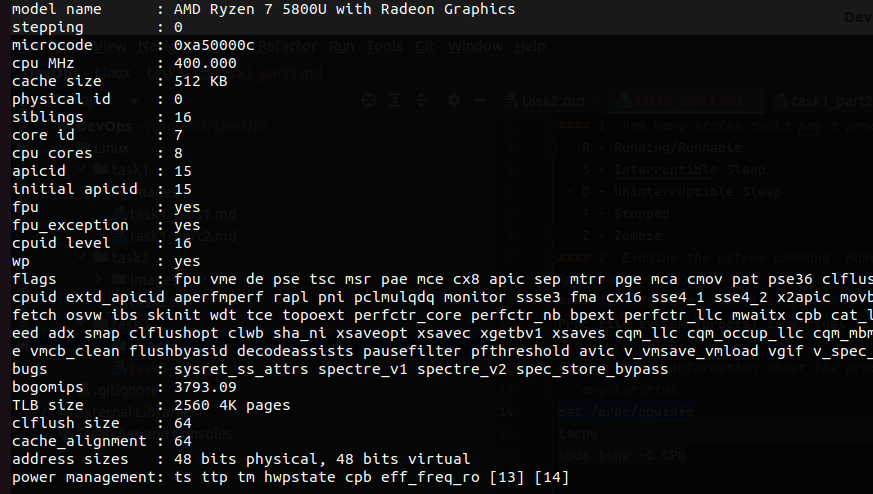
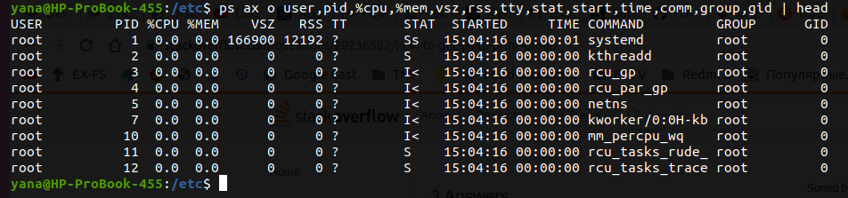
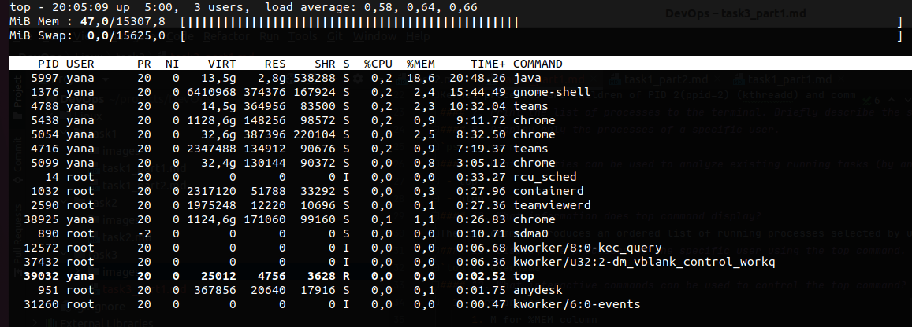
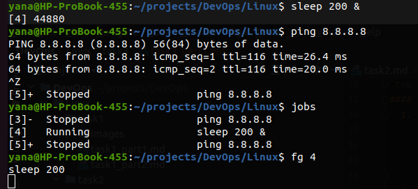

#### 1. How many states could has a process in Linux?
 - R - Running/Runnable
 - S - Interruptible Sleep
 - D - Uninterruptible Sleep
 - T - Stopped
 - Z - Zombie
#### 2. Examine the pstree command. Make output (highlight) the chain (ancestors) of the current process.
`pstree -h`
#### 3. What is a proc file system?
Proc file system (procfs) is virtual file system created on fly when system boots and is dissolved at time of system shut down. It contains useful information about the processes that are currently running, it is regarded as control and information center for kernel. The proc file system also provides communication medium between kernel space and user space.
`ls -l /proc`
#### 4. Print information about the processor (its type, supported technologies, etc.).
```angular2html
cat /proc/cpuinfo
lscpu
sudo lshw -C CPU
```

#### 5. Use the ps command to get information about the process. The information should be as follows: the owner of the process, the arguments with which the process was launched for execution, the group owner of this process, etc.

#### 6. How to define kernel processes and user processes?
Kernel processes are children of PID 2(ppid=2) (kthreadd) and commands are in "[ ]"
#### 7. Print the list of processes to the terminal. Briefly describe the statuses of the processes. What condition are they in, or can they be arriving in?
#### 8. Display only the processes of a specific user.
`ps -u username`
#### 9. What utilities can be used to analyze existing running tasks (by analyzing the help for the ps command)?
 - top
 - htop
#### 10. What information does top command display?
The top command produces an ordered list of running processes selected by user-specified criteria, and updates it periodically. By default, ordering is by CPU usage, and it shows processes that consume maximum CPU. The top command also shows how much processing power and memory are being used, as well as the other information about the running processes.
#### 11. Display the processes of the specific user using the top command.
`top -u username`
#### 12. What interactive commands can be used to control the top command? Give a couple of examples
  1. sort process:
     1. M for %MEM column
     2. N for PID column
     3. T for TIME+
     4. P sort by the %CPU column
  2. 'e' for change display units
  3. 'c' to show full command line
  4. 'i' only active tasks
#### 13. Sort the contents of the processes window using various parameters (for example, the amount of processor time taken up, etc.)

#### 14. Concept of priority, what commands are used to set priority?
`nice, renice or 'r' command from the top`
#### 15. Can I change the priority of a process using the top command? If so, how?
Once given top command, press r. Give PID value of the process you want to change the process value. Give value (from -20 to +19)
#### 16. Examine the kill command. How to send with the kill command process control signal? Give an example of commonly used signals.
`kill -signal -pid`
SIGKILL(9), SIGSTOP (19), SIGCONT (18)
#### 17. Commands jobs, fg, bg, nohup. What are they for? Use the sleep, yes command to demonstrate the process control mechanism with fg, bg.

