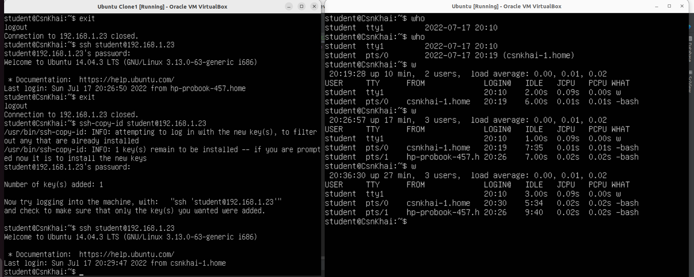
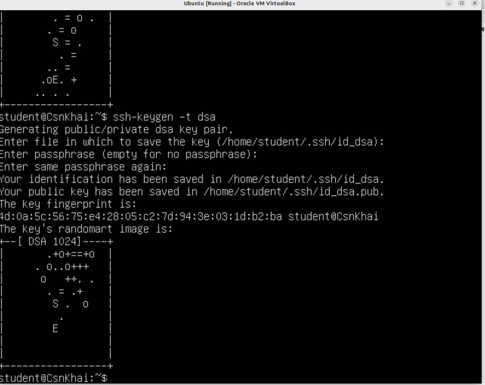
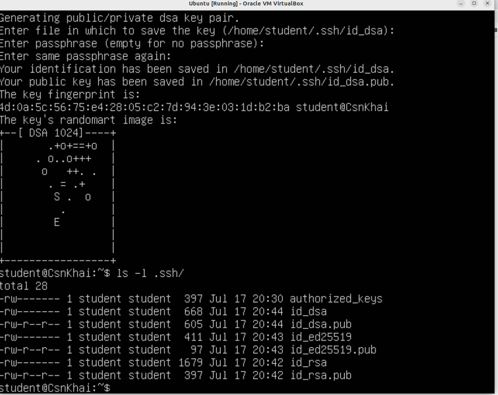
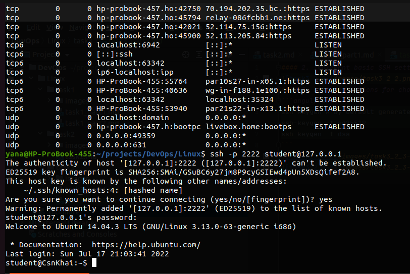

#### 2. Implement basic SSH settings to increase the security of the client-server connection

#### 3. List the options for choosing keys for encryption in SSH. Implement 3 of them.
```angular2html
ssh-keygen # by default generate RSA ssh key
ssh-keygen -t ed25519
ssh-keygen -t dsa
```


#### 4. Implement port forwarding for the SSH client from the host machine to the guest Linux virtual machine behind NAT.


