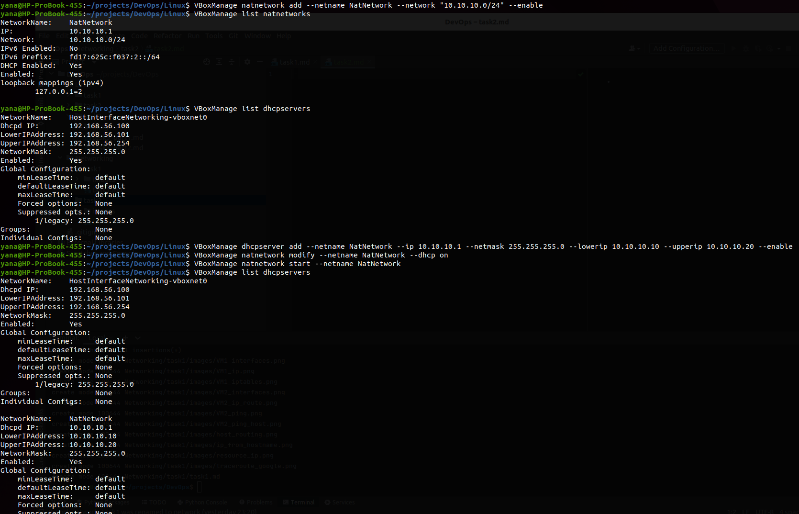
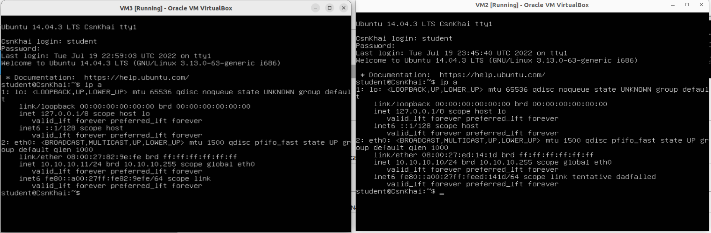
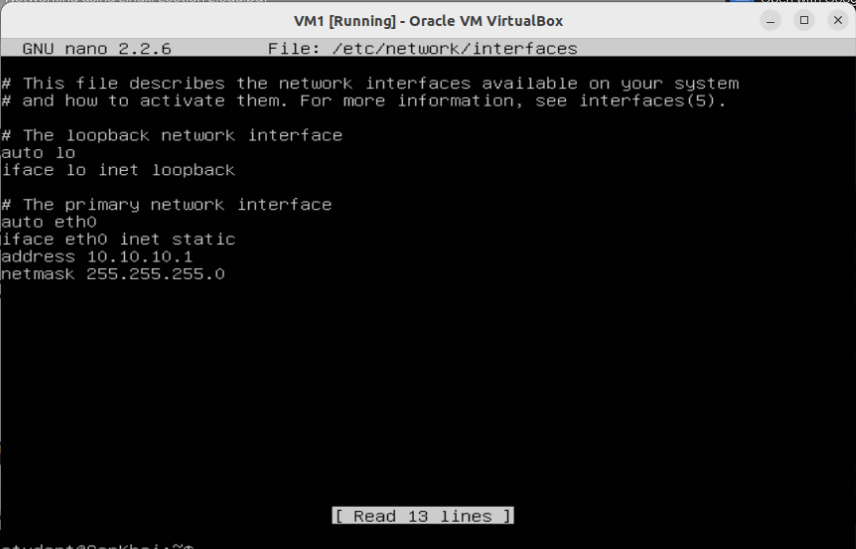
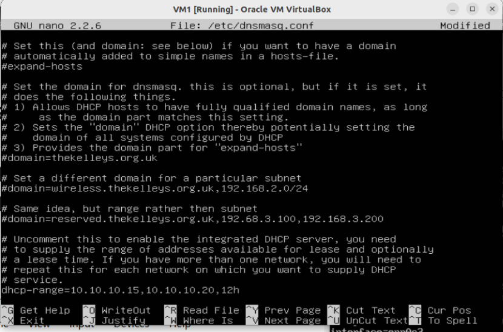
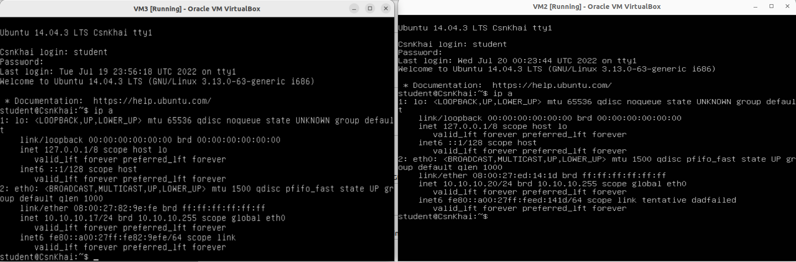
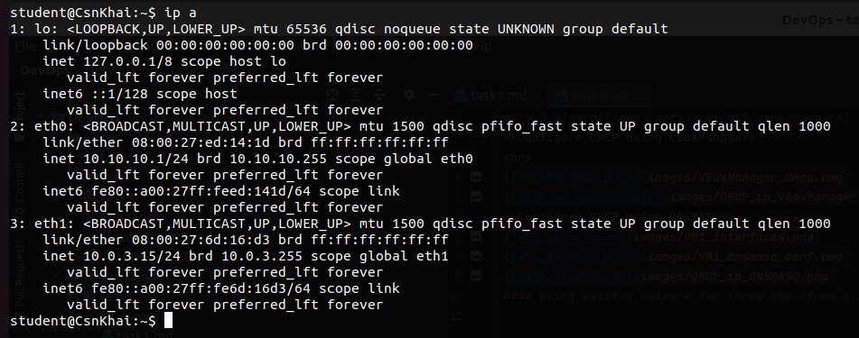
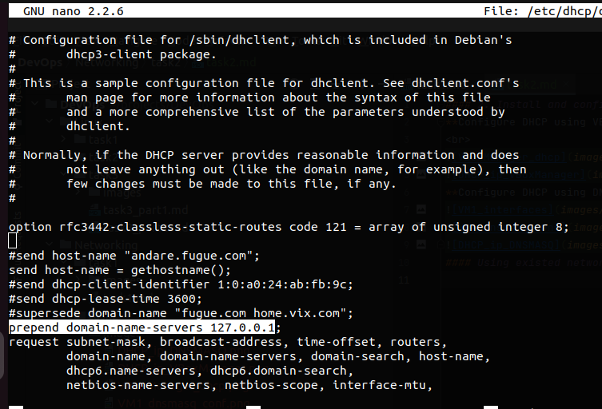
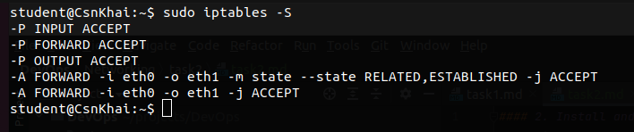
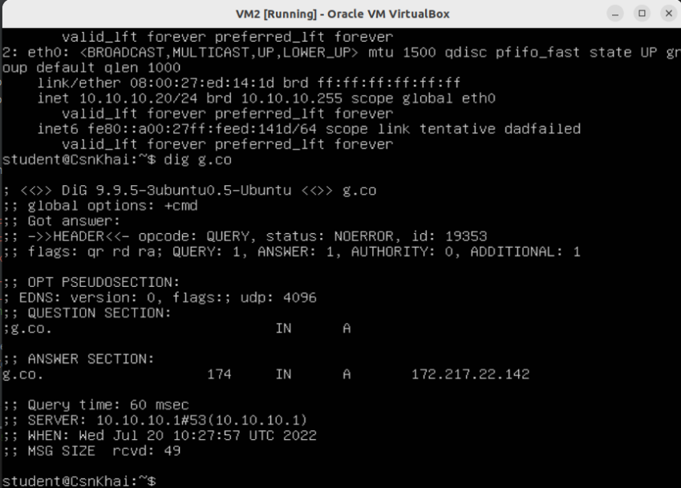
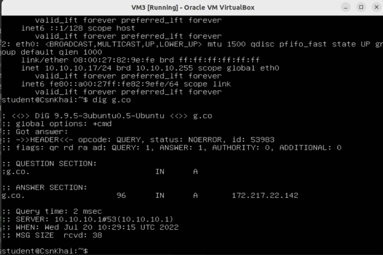

#### 2. Install and configure DHCP server on VM1.
**Configure DHCP using VBoxManage**
 

**Configure DHCP using DNSMASQ**

#### Using existed network for three VMs (from p.1) install and configure DNS server on VM1. (You can use DNSMASQ, BIND9 or something else).

#### Check VM2 and VM3 for gaining access to DNS server (naming services).

